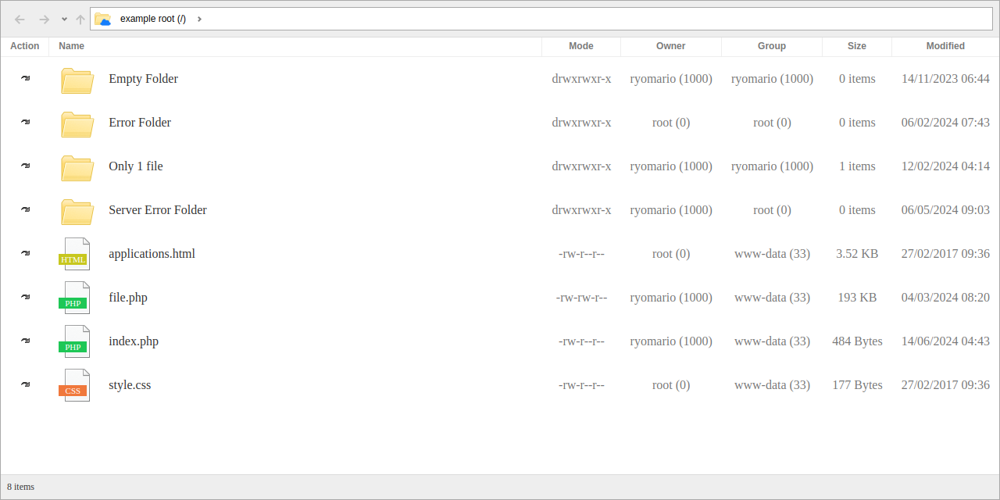

<p align="center"></p>

# Simple Explorer

Only indexing folders and files that readed by server (connected by POST API).

[Demo](https://ryomario.github.io/simple-explorer/)

## API


| | |
| - | - |
| Method | POST |
| Endpoint | / (up to you) |
| Params | `action: "se_explorer_refresh"` fixed value, for identified the action
| | `path: Array<string>` contains entries id |
| Response | `{"success": boolean, "entries": Entry, "error": string \| undefined}`

`Entry` object
```json
{
    "id": string, // entry name
    "name": string, // entry name
    "type": string, // "folder" or "file"
    "hash": string, // entry hash
    "link": string, // entry direct link relative to server doc root
    "mode": string, // permissions
    "owner": string, // owner
    "group": string, // group
    "modified": string, // last modified
    "items_count": number|undefined, // count of entries inside folder
    "size": number|undefined // size of file
}
```